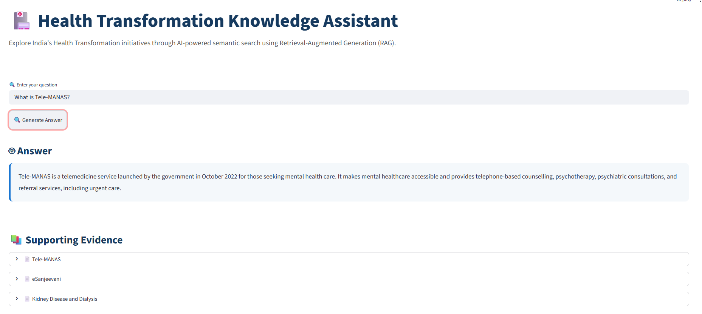

# 🏥 Health Transformation Knowledge Assistant

>An end-to-end Retrieval-Augmented Generation (RAG) application that answers questions about **India's Health Transformation** using semantic search over the official Press Information Bureau (PIB) document.

---

# Project Overview

This project implements a Retrieval-Augmented Generation (RAG) pipeline that enables users to ask natural language questions about India's Health Transformation initiatives.

Instead of relying solely on the language model's internal knowledge, the system retrieves the most relevant information from the provided PIB document using semantic vector search and supplies that context to the LLM before generating an answer. This ensures responses remain grounded in the source document.

---

# Features

- Automated ingestion of the official PIB webpage
- Semantic section-based document chunking
- SentenceTransformer embeddings (`all-MiniLM-L6-v2`)
- ChromaDB vector database with cosine similarity search
- Google Gemini 2.5 Flash for grounded answer generation
- Interactive Streamlit interface
- Supporting evidence displayed for every response

---

# System Architecture

```text
PIB Webpage
      │
      ▼
HTML Extraction (BeautifulSoup)
      │
      ▼
Semantic Section Chunking
      │
      ▼
SentenceTransformer Embeddings
      │
      ▼
ChromaDB (Cosine Similarity)
      │
      ▼
Top Relevant Sections
      │
      ▼
Gemini 2.5 Flash
      │
      ▼
Grounded Answer + Supporting Evidence
```

---

# How the Document is Ingested and Chunked

The source document is downloaded directly from the official Press Information Bureau website using `requests`.

BeautifulSoup extracts the main article content while removing HTML elements such as scripts and styles.

Instead of splitting the document into fixed-size chunks, the application identifies logical section headings and groups related paragraphs together. Large sections are split only when necessary while preserving their section title as metadata.

This semantic chunking strategy maintains context and improves retrieval quality compared to arbitrary fixed-length chunks.

---

# Embeddings and Vector Storage

Each semantic chunk is converted into a dense vector embedding using the SentenceTransformers model:

```
all-MiniLM-L6-v2
```

The generated embeddings are stored in a persistent ChromaDB collection using cosine similarity.

Each stored record contains:

- Chunk text
- Section title
- Display title (used in the UI)
- Embedding vector

The vector database is created once and reused for future searches.

---

# How Semantic Search + RAG Works

When a user submits a question:

1. The question is converted into an embedding.
2. ChromaDB performs cosine similarity search.
3. The most relevant document sections are retrieved.
4. Retrieved sections are combined with the user question.
5. Gemini 2.5 Flash generates an answer using only the retrieved context.
6. The application displays both the generated answer and the supporting sections used for retrieval.

---

# Tech Stack

| Component | Technology |
|------------|------------|
| Language | Python |
| UI | Streamlit |
| Web Scraping | Requests + BeautifulSoup |
| Embeddings | SentenceTransformers |
| Vector Database | ChromaDB |
| LLM | Google Gemini 2.5 Flash |

---

# Project Structure

```text
health-rag-assistant/
│
├── app.py
├── rag.py
├── ingest.py
├── implementation.md
├── requirements.txt
├── README.md
│
├── data/
│   └── document.txt
│
└── chroma_db/
```

---

# Installation

Clone the repository

```bash
git clone https://github.com/vaibhavitej-a11y/health-rag-assistant.git
```

Install dependencies

```bash
pip install -r requirements.txt
```

Create a `.env` file

```env
GEMINI_API_KEY=YOUR_API_KEY
```

---

# Running the Project

Extract the source document

```bash
python ingest.py
```

Build the vector database

```bash
python rag.py
```

Launch the application

```bash
streamlit run app.py
```

---

# Example Questions

- What is PM-JAY?
- What is ABDM?
- What are Ayushman Arogya Mandirs?
- What is Tele-MANAS?
- How has healthcare infrastructure improved?

---

# Screenshot



---

# Future Improvements

- Hybrid keyword + semantic retrieval
- Retrieval reranking
- Multi-document support
- PDF upload capability
- Highlight retrieved text spans
- Conversational memory

---

# Source Document

Official Press Information Bureau

https://www.pib.gov.in/PressReleasePage.aspx?PRID=2269699&reg=48&lang=2 
